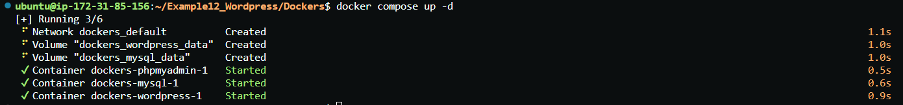
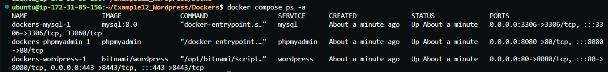
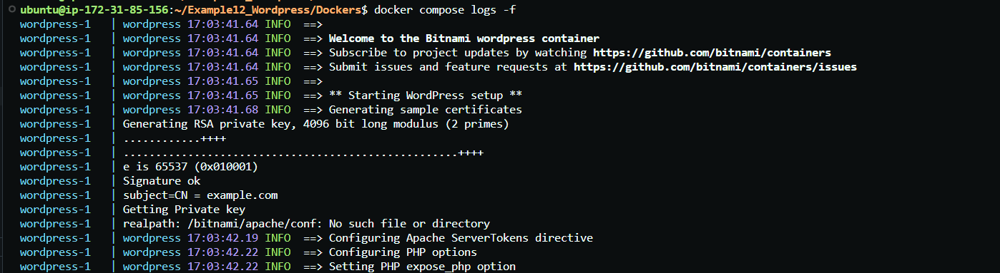
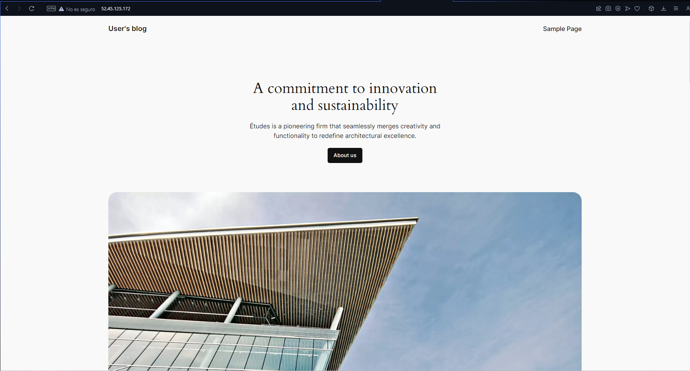
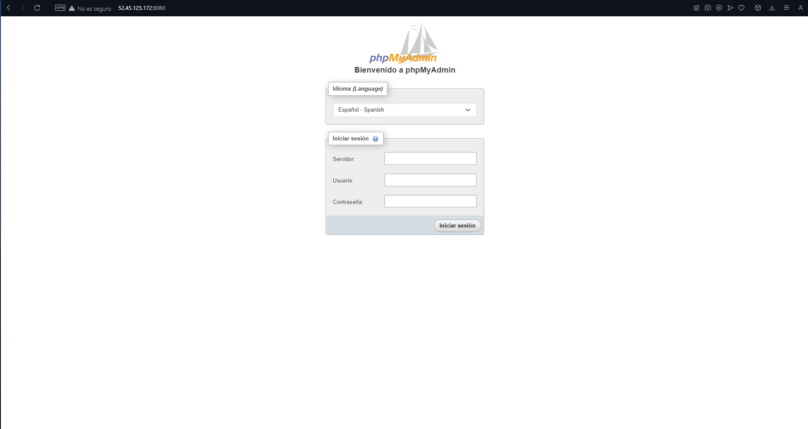

# Example12_Wordpress
En este ejemplo tendremos que generar la estructura de Docker para poder descargar Wordpress, tanto por el puerto 80 como haciendo uso del certificado con Let´s Encrypt.


# Primer apartado de la práctica.

- Tendremos que generar un código que nos permita poder instalar wordpress a través de un *_docker_*. Para esto tendremos que hacer uso del siguiente código, pero teniendo en cuenta una serie de `excepciones` bastantes importantes.

    ``` 

    version: '3'

    services:
    wordpress:
        image: bitnami/wordpress
        ports:
        - 80:8080
        - 443:8443
        environment: 
            #IMPORTANTE BUSCAR EXACTAMENTE EL NOMBRE DE CADA UNA. ES DECIR, EN EL .ENV PUEDEN LLAMARSE COMO QUIERAN
            #PERO AQUÍ TENEMOS QUE BUSCAR EXACTAMENTE COMO SE LLAMAN
            # EN ESTE CASO EN BITNAMI/WORDPRESS
        - WORDPRESS_DATABASE_HOST=mysql
        - WORDPRESS_DATABASE_NAME=${WORDPRESS_DB_NAME}
        - WORDPRESS_DATABASE_USER=${WORDPRESS_DB_USER}
        - WORDPRESS_DATABASE_PASSWORD=${WORDPRESS_DB_PASSWORD}
        - WORDPRESS_DATABASE_PORT_NUMBER=${WORDPRESS_DATABASE_PORT_NUMBER}
        - ALLOW_EMPTY_PASSWORD=yes
        volumes: 
        - wordpress_data:/var/www/html
        depends_on:
        - mysql
        restart: always

    mysql:
        image: mysql:8.0
        ports:
        - 3306:3306
        environment:
        - MYSQL_ROOT_PASSWORD=${MYSQL_ROOT_PASSWORD}
        - MYSQL_DATABASE=${WORDPRESS_DB_NAME}
        - MYSQL_USER=${WORDPRESS_DB_USER}
        - MYSQL_PASSWORD=${WORDPRESS_DB_PASSWORD}
        volumes:
        - mysql_data:/var/lib/mysql
        restart: always

    phpmyadmin:
        image: phpmyadmin
        ports:
        - 8080:80
        environment: 
        - PMA_ARBITRARY=1
        restart: always

    volumes: 
    mysql_data:
    wordpress_data:


    ```

## Apartados a comentar.

- El primer bloque que debemos de comentar es el siguiente: 

    ```
    environment: 
            #IMPORTANTE BUSCAR EXACTAMENTE EL NOMBRE DE CADA UNA. ES DECIR, EN EL .ENV PUEDEN LLAMARSE COMO QUIERAN
            #PERO AQUÍ TENEMOS QUE BUSCAR EXACTAMENTE COMO SE LLAMAN
            # EN ESTE CASO EN BITNAMI/WORDPRESS
        - WORDPRESS_DATABASE_HOST=mysql
        - WORDPRESS_DATABASE_NAME=${WORDPRESS_DB_NAME}
        - WORDPRESS_DATABASE_USER=${WORDPRESS_DB_USER}
        - WORDPRESS_DATABASE_PASSWORD=${WORDPRESS_DB_PASSWORD}
        - WORDPRESS_DATABASE_PORT_NUMBER=${WORDPRESS_DATABASE_PORT_NUMBER}
        - ALLOW_EMPTY_PASSWORD=yes

    ```

- Lo apartados más importantes que encontramos aquí es que las variables que tenemos dentro de nuestro `environment` tienen que llamarse IGUAL que las variables que encontramos en *_DockerHub_* sobre la instalación de `bitnami/wordpress`. 

- Esto se debe a qué esta *_empresa_* desarrolla este prestashop con una serie de variables que tienen que definirse así es la estructura del docker, pero en nuestro *_.env_* podrán llamarse de la manera que queramos.

### Destacamos 3.

1. `WORDPRESS_DATABASE_PORT_NUMBER=${WORDPRESS_DATABASE_PORT_NUMBER}` --> Puerto por el que se va a conectar a nuestro servicio de `MySQL`

2. `ALLOW_EMPTY_PASSWORD=yes` --> Para que no nos proporcione ningun tipo de error de acceso a nuestro servicio.

3. ` ports:
        - 80:8080
        - 443:8443` --> El puerto *_8443_* es el puerto que utiliza *_bitnami_* para poder conectarse.

# Comprobación de funcionamiento de nuestro servicio al puerto *_80_* y *_8080_*

- Antes de enseñar la comprobación, tendremos que tener lo anterior configurado de la manera correcta.

1. `docker compose up -d` --> Lanzamos los contenedores en *_background_* 

    

2. `docker compose ps -a` --> Podemos ver toda la información de los contenedores actualmente en uso.

    

3. `docker compose logs -f` --> Podemos ver los logs del sistema para ver que está bien o mal.

    

### Comprobamos accediendo a la URL.

- Accedemos a la *_ip_* *_elastica_* de nuestra máquina y podremos comprobar que se ha realizado la instalación correctamente.

    


- Conexión con PHP.

    
